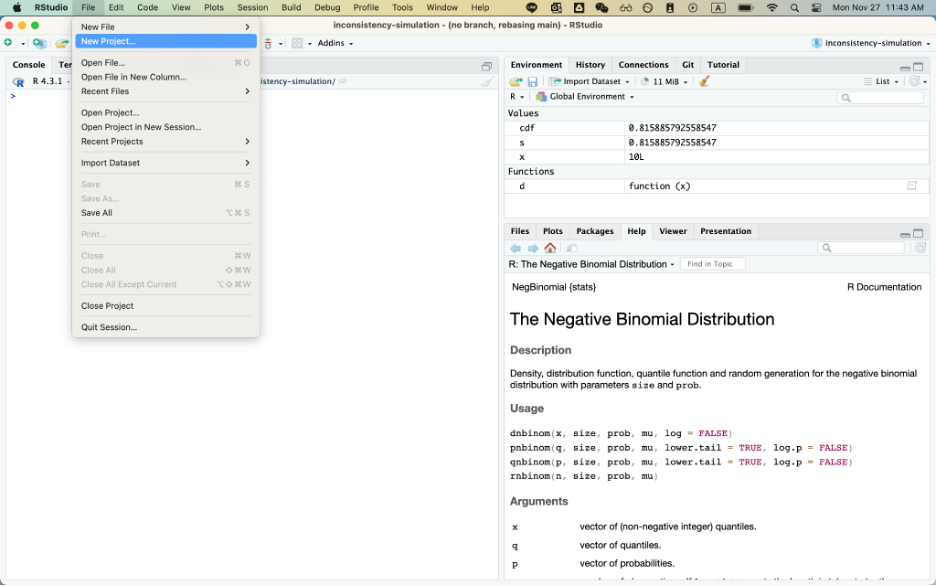
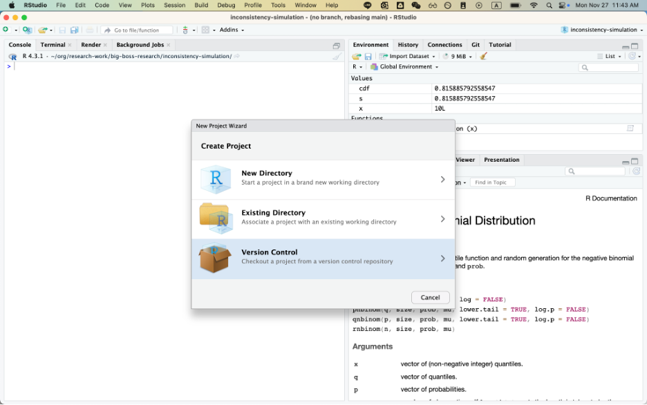
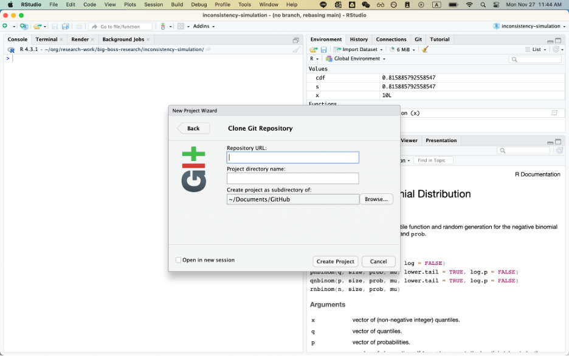
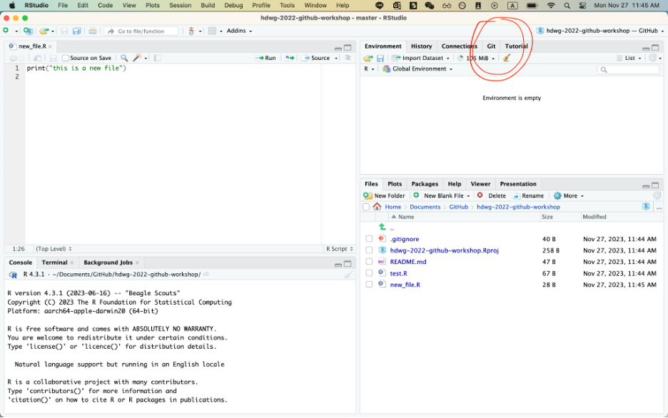

# Target Trial Workshop

Welcome to the Target Trial Workshop at UCalgary! This workshop is designed to introduce you to the target trial framework for causal inference from both the theoretical and practical perspectives. We will be using the `R` programming language to simulate and analyze data.

⭐ **Acknowledgements**: Material from this workshop is based on the [Target Trial Short course](https://github.com/bldestavola/TTE-Short-Course) by Dr. Michalis Katsoulis.

## Downloading RStudio

Please have R and RStudio installed on your computer before the workshop. You can download R and RStudio from [Posit's website](https://posit.co/download/rstudio-desktop/).

## Cloning the repository

You can clone this repository via RStudio by following these steps:

#### Step 1: New Project

#### Step 2: Version Control

#### Step 3: Clone Git Repository

#### Step 4

Notice the `Git` tab on the top right corner of RStudio. You can use this tab to commit changes, pull, push, etc.

If you would like to learn more about version control, Git and GitHub, you can learn more from my [presentation](https://docs.google.com/presentation/d/1bRzyNSGUGTeDwYJ-wLkjOH3SkMZtR5BzYA1b48rjBMI/edit?usp=sharing), or just ask me.
